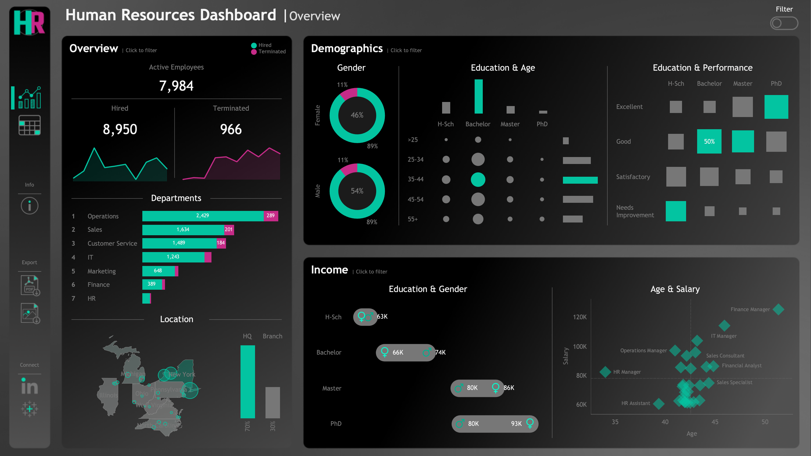
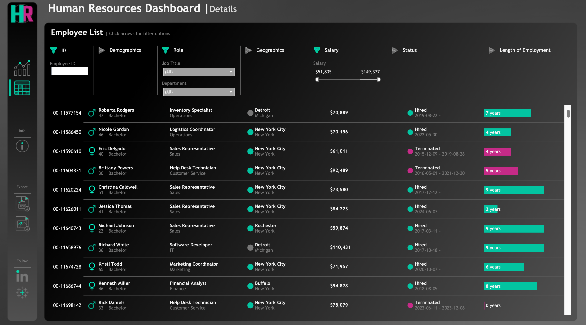

# HR Dashboard | Tableau

## Dashboard Overview



## Dashboard Details



---

## Project Overview

This project involves building a comprehensive **HR Analytics Dashboard** using Tableau to analyze human resources data. The dashboard provides both high-level summary views for HR managers and detailed employee records for in-depth analysis.

1. **Data Generation**: Generating a realistic HR dataset of 8,950 employee records using Python.
2. **Data Analysis**: Exploring workforce composition, demographics, income patterns, and performance.
3. **Dashboard Design**: Building an interactive Tableau dashboard with two main views — Summary and Employee Records.

---

## Dashboard Requirements

### Summary View

The Summary View is divided into three sections:

#### Overview
- Display total hired, active, and terminated employees.
- Visualize hiring and termination trends over the years.
- Break down total employees by department and job title.
- Compare employee count between HQ (New York) and branch locations.
- Show the distribution of employees by city and state.

#### Demographics
- Present the gender ratio across the company.
- Visualize the distribution of employees by age group and education level.
- Show the total number of employees within each age group.
- Show the total number of employees within each education level.
- Present the correlation between educational background and performance ratings.

#### Income Analysis
- Compare salaries across education levels for both genders to identify discrepancies.
- Show how age correlates with salary for employees in each department.

---

### Employee Records View
- Provide a full list of all employees with key attributes: name, department, position, gender, age, education, and salary.
- Allow users to filter the list by any available column.

---

## Data Generation

The dataset was synthetically generated using Python with the following specifications:

- **Total Records**: 8,950 employees
- **Libraries Used**: `pandas`, `numpy`, `faker`

### Dataset Attributes

| Field | Description |
|---|---|
| Employee ID | Unique identifier |
| First & Last Name | Randomly generated using Faker |
| Gender | 46% Female / 54% Male |
| State & City | Randomly assigned from 8 US states |
| Hire Date | Random dates from 2015–2024 with custom year weights |
| Department | 7 departments with weighted probabilities |
| Job Title | Role assigned based on department |
| Education Level | Determined by job title mapping |
| Performance Rating | Excellent / Good / Satisfactory / Needs Improvement |
| Overtime | 30% Yes / 70% No |
| Salary | Generated by department and job title ranges |
| Birth Date | Based on age group distribution and role requirements |
| Termination Date | Assigned to 11.2% of employees (at least 6 months after hire date) |
| Adjusted Salary | Calculated based on gender, education level, and age multipliers |

### Departments & Job Titles

| Department | Job Titles |
|---|---|
| HR | HR Manager, HR Coordinator, Recruiter, HR Assistant |
| IT | IT Manager, Software Developer, System Administrator, IT Support Specialist |
| Sales | Sales Manager, Sales Consultant, Sales Specialist, Sales Representative |
| Marketing | Marketing Manager, SEO Specialist, Content Creator, Marketing Coordinator |
| Finance | Finance Manager, Accountant, Financial Analyst, Accounts Payable Specialist |
| Operations | Operations Manager, Operations Analyst, Logistics Coordinator, Inventory Specialist |
| Customer Service | Customer Service Manager, Customer Service Representative, Support Specialist, Help Desk Technician |

---

## Files

```
├── HumanResources.csv              # Generated HR dataset (8,950 records)
├── generate_hr_data.py             # Python script for data generation
├── HR_Dashboard.twbx               # Tableau packaged workbook
├── hr-dashboard-mockups.png        # Containerized view of the summary and details dashboard
└── docs/
    ├── hr_dashboard_overview.png   # Summary view screenshot
    └── hr_dashboard_details.png    # Employee records view screenshot
```

---

## Tech Stack

| Tool | Purpose |
|---|---|
| **Tableau** | Dashboard design and visualization |
| **Python** | Synthetic data generation |
| **Pandas & NumPy** | Data manipulation and statistical generation |
| **Faker** | Realistic name and date generation |
| **SQL** | Data querying and calculations inside Tableau |

---

## License

This project is licensed under the [MIT License](LICENSE). You are free to use, modify, and share this project with proper attribution.
